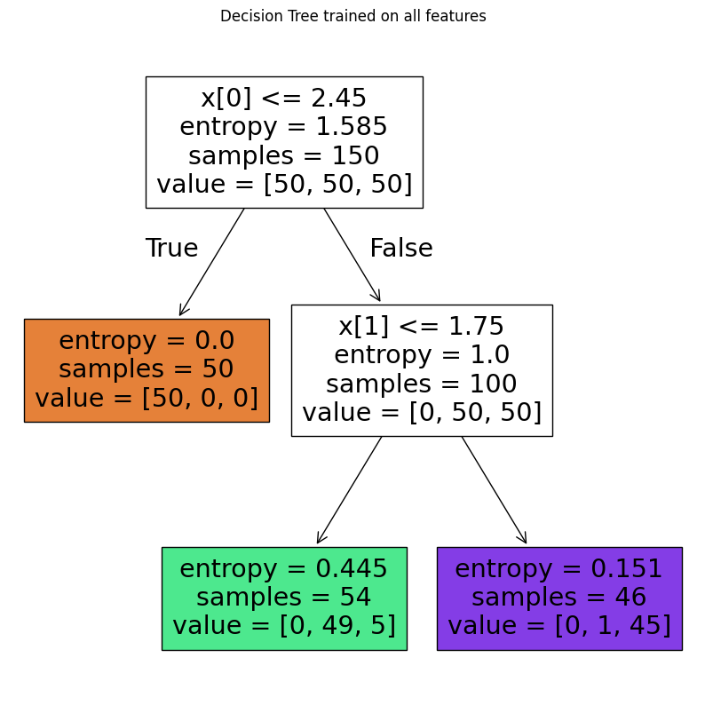
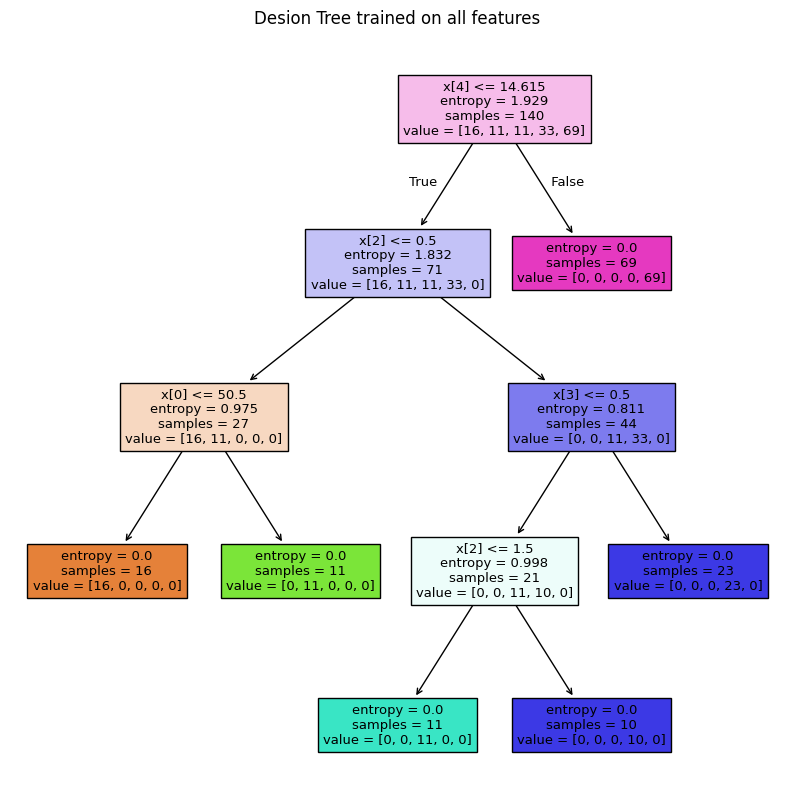

# Decision Tree - A tree🌳to make predictions!


## 📒 What is Decision Tree❓

A decision tree is a popular machine learning model used for both classification and regression tasks.

It's called a decision tree because it breaks down a dataset into smaller subsets while developing an increasingly detailed decision-making process resembling a tree's structure.


```{python}
   Is it raining outside?
     /               \
   Yes               No
    |                 |
 Grab an          Enjoy the 
 umbrella          sunshine
```

> Some key components and concepts related to decision trees:

1. **Nodes**: Represent a decision or a test on a specific attribute (feature) in the dataset;

2. **Edges**: Correspond to the outcome of a decision or a test, leading to the next node or leaf node;

3. **Root Node**: The topmost node that corresponds to the best predictor in the dataset;

4. **Internal Nodes**: Nodes that have child nodes and represent a decision rule based on a feature;

5. **Leaf Nodes**: Terminal nodes that predict the outcome (decision) of the model;

6. **Decision Rules**: The path from the root to the leaf represents a decision rule;

## 📒 How a Decision Tree is Built❓

1. **Splitting**: The process of dividing a node into two or more sub-nodes based on a feature's value. The goal is to minimize uncertainty or impurity at each split;

2. **Impurity Measures**: Common measures include Gini impurity and entropy (information gain);

3. **Stopping Criteria**: Conditions when to stop splitting further, such as reaching a maximum depth, minimum samples at a node, or no further improvement in impurity reduction;

4. **Pruning**: The process of removing parts of the tree that do not provide any additional predictive power. This helps prevent overfitting.

### Let's do an example❗

## 👨‍💻 Programming language

- 


## 📦 Libraries necessaries

```{python}
from sklearn.datasets import load_iris 
from sklearn.tree import DecisionTreeClassifier
from sklearn import tree
import matplotlib.pyplot as plt
```

## 🔋 Load the dataset - Iris
```{python}
# Load dataset iris
iris = load_iris()
```

## 💻 Set the features and target
```{python}
# set features and target
X = iris.data[:, 2:] # petal length and width
y = iris.target # target
```

## 💻🌳 Model - Decistion Tree

```{python}
# model
tree_clf = DecisionTreeClassifier(max_depth=2)
```

## 🖥️🪫 Train the model
```{python}
# fit
tree_clf.fit(X, y)

```
## 🌳 Let's see the Tree🌳

```{python}
# plot tree
plt.figure(figsize=(10, 10))
tree.plot_tree(tree_clf, filled=True)
plt.title("Decision Tree trained on all features")
plt.show()
```


As we can see, the algorithm broke down dataset into 2 smaller subsets (trees)This approach is an effective way to predict an outcome.

### Let's see the decision tree in a more complex dataset❗

Imagine you are a medical researcher gathering data for a study. You've gathered information on a group of patients, all diagnosed with the same illness. Each patient underwent treatment with one of five medications: **Drug A**, **Drug B**, **Drug C**, **Drug X**, or **Drug Y**.

As part of your role, you need to develop a model to predict which drug would be suitable for future patients with the same illness. The dataset includes features such as **Age**, **Sex**, **Blood Pressure**, and Cholesterol levels of the patients, while the **target variable is the medication** to which each patient responded.

This dataset serves as a multiclass classifier sample. You can utilize the training portion of the dataset to construct a decision tree. Subsequently, this tree can be employed to predict the classification of an unfamiliar patient or to recommend a medication for a new patient.

### Let's do it❗

## 📦 Libraries necessaries

```{python}
import numpy as np 
import pandas as pd
from sklearn.model_selection import train_test_split
from sklearn.tree import DecisionTreeClassifier
import sklearn.tree as tree
from sklearn import metrics
import matplotlib.pyplot as plt
```
## 🔋 Load the dataset - IBM

The dataset utilized is available in the *Machine Learning with Python* in the [Cognitive Class.ai](https://cognitiveclass.ai/courses/machine-learning-with-python).

```{python}
my_data = pd.read_csv('https://cf-courses-data.s3.us.cloud-object-storage.appdomain.cloud/IBMDeveloperSkillsNetwork-ML0101EN-SkillsNetwork/labs/Module%203/data/drug200.csv', delimiter=",")

my_data.head(10)
```

</style>
<table border="1" class="dataframe">
  <thead>
    <tr style="text-align: right;">
      <th></th>
      <th>Age</th>
      <th>Sex</th>
      <th>BP</th>
      <th>Cholesterol</th>
      <th>Na_to_K</th>
      <th>Drug</th>
    </tr>
  </thead>
  <tbody>
    <tr>
      <th>0</th>
      <td>23</td>
      <td>F</td>
      <td>HIGH</td>
      <td>HIGH</td>
      <td>25.355</td>
      <td>drugY</td>
    </tr>
    <tr>
      <th>1</th>
      <td>47</td>
      <td>M</td>
      <td>LOW</td>
      <td>HIGH</td>
      <td>13.093</td>
      <td>drugC</td>
    </tr>
    <tr>
      <th>2</th>
      <td>47</td>
      <td>M</td>
      <td>LOW</td>
      <td>HIGH</td>
      <td>10.114</td>
      <td>drugC</td>
    </tr>
    <tr>
      <th>3</th>
      <td>28</td>
      <td>F</td>
      <td>NORMAL</td>
      <td>HIGH</td>
      <td>7.798</td>
      <td>drugX</td>
    </tr>
    <tr>
      <th>4</th>
      <td>61</td>
      <td>F</td>
      <td>LOW</td>
      <td>HIGH</td>
      <td>18.043</td>
      <td>drugY</td>
    </tr>
    <tr>
      <th>5</th>
      <td>22</td>
      <td>F</td>
      <td>NORMAL</td>
      <td>HIGH</td>
      <td>8.607</td>
      <td>drugX</td>
    </tr>
    <tr>
      <th>6</th>
      <td>49</td>
      <td>F</td>
      <td>NORMAL</td>
      <td>HIGH</td>
      <td>16.275</td>
      <td>drugY</td>
    </tr>
    <tr>
      <th>7</th>
      <td>41</td>
      <td>M</td>
      <td>LOW</td>
      <td>HIGH</td>
      <td>11.037</td>
      <td>drugC</td>
    </tr>
    <tr>
      <th>8</th>
      <td>60</td>
      <td>M</td>
      <td>NORMAL</td>
      <td>HIGH</td>
      <td>15.171</td>
      <td>drugY</td>
    </tr>
    <tr>
      <th>9</th>
      <td>43</td>
      <td>M</td>
      <td>LOW</td>
      <td>NORMAL</td>
      <td>19.368</td>
      <td>drugY</td>
    </tr>
  </tbody>
</table>
</div>

## 💻 Preparing the data

We need to set features matrix (X) and outcome vector (y).

### Let's do it❗

Let's start selecting features.

```{python}
X = my_data[['Age', 'Sex', 'BP', 'Cholesterol', 'Na_to_K']].values

X[0:5]
```

```
# output
array([[23, 'F', 'HIGH', 'HIGH', 25.355],
       [47, 'M', 'LOW', 'HIGH', 13.093],
       [47, 'M', 'LOW', 'HIGH', 10.114],
       [28, 'F', 'NORMAL', 'HIGH', 7.798],
       [61, 'F', 'LOW', 'HIGH', 18.043]], dtype=object)
```

As we can see, some in this dataset are categorical, such as **Sex** or **BP**. 

The Sklearn Decision Trees does not handle categorical variables, we can convert these features to numerical values.

Let's use the **LabelEncoder() method** to convert the categorical variable into dummy variables.

```{python}
from sklearn import preprocessing

le_sex = preprocessing.LabelEncoder()
le_sex.fit(['F','M'])
X[:,1] = le_sex.transform(X[:,1]) 


le_BP = preprocessing.LabelEncoder()
le_BP.fit([ 'LOW', 'NORMAL', 'HIGH'])
X[:,2] = le_BP.transform(X[:,2])


le_Chol = preprocessing.LabelEncoder()
le_Chol.fit([ 'NORMAL', 'HIGH'])
X[:,3] = le_Chol.transform(X[:,3]) 

X[0:5]
```

```{python}
# output
array([[23, 0, 0, 0, 25.355],
       [47, 1, 1, 0, 13.093],
       [47, 1, 1, 0, 10.114],
       [28, 0, 2, 0, 7.798],
       [61, 0, 1, 0, 18.043]], dtype=object)
```

### YEAH, now yes👍

Now we can fill the target variable.

```{python}
y = my_data["Drug"]

y[0:5]
```

```{python}
# output
0    drugY
1    drugC
2    drugC
3    drugX
4    drugY
Name: Drug, dtype: object
```

## 📌 Spliting data into train and test

It is easy to do with *sklearn.model_selection*.

```{python}
X_trainset, X_testset, y_trainset, y_testset = train_test_split(X, y, test_size=0.3, random_state=3)
```
### Let's see train dataset

```{python}
print(X_trainset.shape)
print(y_trainset.shape)

print('Shape of X training set {}'.format(X_trainset.shape),'&',' Size of Y training set {}'.format(y_trainset.shape))
```

```{python}
# output
(140, 5)
(140,)
Shape of X training set (140, 5) &  Size of Y training set (140,)

```
### Let's see test dataset

```{python}
print(X_testset.shape)
print(y_testset.shape)

print('Shape of X testset set {}'.format(X_testset.shape),'&',' Size of Y training set {}'.format(y_testset.shape))
```
```{python}
# output
(60, 5)
(60,)
Shape of X testset set (60, 5) &  Size of Y training set (60,)
```

### NOW, we are ready for modelling 😎

## 💻🌳 Model - Decistion Tree

First, we created an instance of the DecisionTreeClassifier (*drugTree*).

We set 4 max_depth and entropy to choose the best feature  at each decision tree node during the model building process.

```{python}
drugTree = DecisionTreeClassifier(criterion="entropy", max_depth = 4)
drugTree
```

## 🖥️🪫 Train the model

```{python}
drugTree.fit(X_trainset,y_trainset)
```

## 💭 Let's make predictions!

Let's make some predictions on the testing dataset. 

```{python}
predTree = drugTree.predict(X_testset)
```

Let's see if Decision Tree is correct!

```{python}
print('Predicted:', predTree[0:5])
print('Target:', np.array(y_testset[0:5]))
```

```{python}
# output
Predicted: ['drugY' 'drugX' 'drugX' 'drugX' 'drugX']
Target: ['drugY' 'drugX' 'drugX' 'drugX' 'drugX']
```

### AMAZING!!!, all 5 first are right!👏👏👏

Let's see the precision of the model.

## 🎯 Evaluate the trained model
```{python}
print("DecisionTrees's Accuracy: ", round(metrics.accuracy_score(y_testset, predTree),2))
```

```{python}
# output
DecisionTrees's Accuracy:  0.98
```

### 😮WOwwww...This Decision Tree trained is highly accurate!

## 🌳 Let's see the Tree🌳

```{python}
plt.figure(figsize=(10, 10))
tree.plot_tree(drugTree, filled=True)
plt.title("Decision Tree trained on all features")
plt.show()
```



Although results suggest that Decision Trees are highly accurate, it is crucial to emphasize that this algorithm can easily overfit noisy data.


## 🤓 Conclusion

Decision trees are foundational in machine learning due to their straightforward yet powerful approach to decision-making. They represent a hierarchical tree-like structure where each internal node denotes a decision based on a specific feature, and each leaf node represents a final decision or outcome. This structure allows for easy interpretation and visualization of how decisions are made within the model.

Nevertheless, concerns such as overfitting, instability, and other potential challenges must be conscientiously addressed when employing decision trees.

It is noteworthy decision trees are fundamental in machine learning due to their simplicity and effectiveness, forming the basis for more complex ensemble methods like Random Forests and Gradient Boosting 

Finally, decision trees remain integral to machine learning due to their intuitive nature, flexibility in handling different types of data, and pivotal role in the development of more advanced predictive models.


## 👍Advantages of Decision Trees:

1. **Interpretability**: Easy to understand and interpret, suitable for visual representation.

2. **Handling Non-linearity**: Can capture non-linear relationships between features and target variable.

3. **Feature Selection**: Automatically selects important features.

4. **Handles Missing Data**: Can handle missing values without requiring imputation.

## 👎Disadvantages of Decision Trees:

1. **Overfitting**: Can easily overfit noisy data.

2. **Instability**: Small variations in the data can result in a completely different tree.

3. **Bias Towards Dominant Classes**: May create biased trees if one class dominates.

4. **Not Suitable for Regression with Continuous Variables**: Decision trees may not be the best choice for predicting continuous variables.

#

Hope you enjoyed it!


## References

1. [Machine Learning with Python - Cognitive Class.ai](https://cognitiveclass.ai/courses/machine-learning-with-python)
2. [Hands-On Machine Learning with Scikit-Learn, Keras, and TensorFlow](https://www.amazon.com.br/Hands-Machine-Learning-Scikit-Learn-Tensorflow/dp/1098125975/ref=sr_1_1?adgrpid=1142393274543477&dib=eyJ2IjoiMSJ9.oREN7JM-frcTK7Uqq_n9oDPD1S-XamLOzJLcu0iSpaTMYMHpzvkscKQcVucYJO7EjXgMFmIvNV_AmM5ao7JNAi2EvZ6RwCaART-m4Gz7aKR-Icg-Q3XQS_sGiVtd-GTNGwHWf5OJBc8x10v0w1mpaCyPm3ZK_zRUeq4HmFB7qNKh1qubHbP9aZvF2VdLZY2WEzOw2FoSlogbPdIlAVcY0zDMpr6DonsuTLxYNkrMIKd48IvouLwbVezBFUnAVuF2mnpYaYcExY5OA2dfo86wubGzbrWDxYr5XGuiczud2jQ.zGo9Anc3YhkjskruerGwGWNLkAOmfz6UxI6GeewXep8&dib_tag=se&hvadid=71399743809987&hvbmt=be&hvdev=c&hvlocphy=147064&hvnetw=o&hvqmt=e&hvtargid=kwd-71400106976091%3Aloc-20&hydadcr=5656_13210377&keywords=hands-on+machine+learning&qid=1720813369&sr=8-1&ufe=app_do%3Aamzn1.fos.e05b01e0-91a7-477e-a514-15a32325a6d6)

👨‍💻 Made by Saulo Gil.